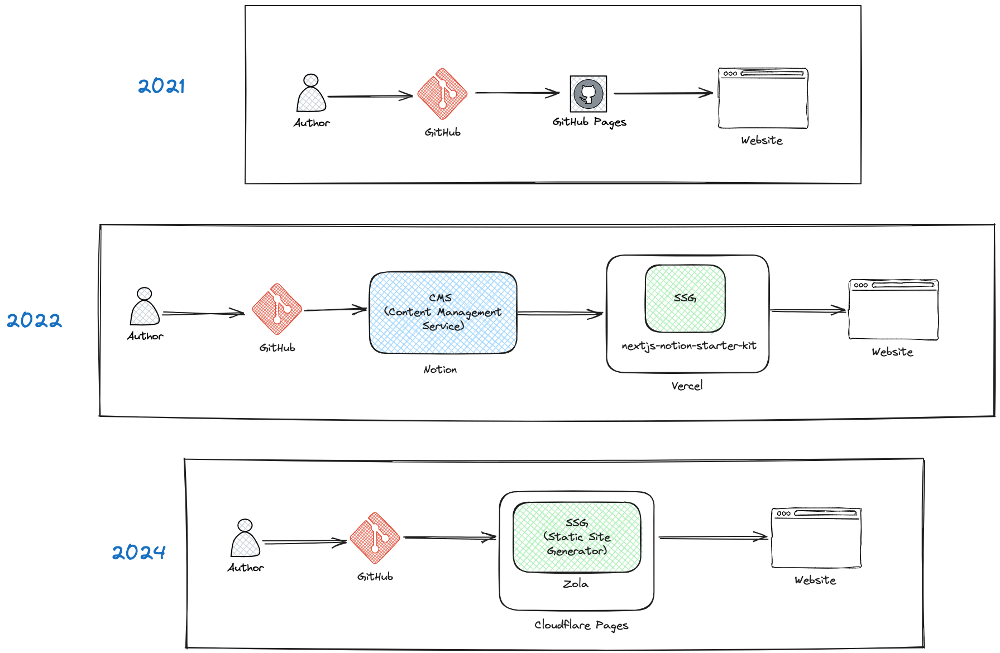

+++
path = "blog/new-website"
title = "New Website"
description = "New Website: My personal website."
date = "2024-07-23"
draft = true

[taxonomies]
tags=["website", "personal-website"]
+++

## Comparision between the websites

| Feature | 2021 Website | 2022 Website | 2024 Website |
|:--------|:-------------|:-------------|:-------------|
| Text input | HTML | Text | Markdown |
| Load time | Fast | Slow | Fastest |
| SEO | Ok | Good | Best |
| RSS Feed | No | No | Yes |
| Comments | No | No | Yes |

* I have created a new website for myself and my blog on Medium.
* Back then the website was a simple bootstrap template website. However, I did not figure out how to write posts in a structured reusable way. Therefire, I had to write many repetitive code and I was not happy with the design of the website.

In 2022 I have become a huge fan of Notion and I have used a GitHub repository to convert my notion pages to a website. I used Hashnode for my blog. I moved from Medium to Hashnode and I was not happy with the design of the website. I could not update the internal structure of the website due to some limitations from Vercel. Yes, I was using Vercel to render from Notion to Static webpages. On the othe hand, Hashnode could not open my blog posts as they blocked by office VPN. They did not provide any permamnent soultion or ETA for this.
At the back of my mind, I was also thinking of creating a website which will be simple, lightweight and fastest to load in a 2G connection. I was about to go with a theme from Hugo, but then a post from Karan turned me to swtitch to Zola. I also love Rust. So, I have decided to use Zola. The themes are limited, but I liked a couple of them. I have also used the [Zola Apollo](https://github.com/not-matthias/apollo) theme. It is a simple and clean theme.

## Tech stack evolution over the years

## Challenges
* Migrating the old website links to the new website.
* Migrating and converting the old notion pages to Markdown format.

## Resources Borrowed

| Feature | Link |
|:--------|:-----|
| Theme | [Apollo](https://github.com/not-matthias/apollo) |
| Footer | [Sebastian Müller](https://github.com/sbmueller/sbmueller.github.io) |
| YouTube | Karan |