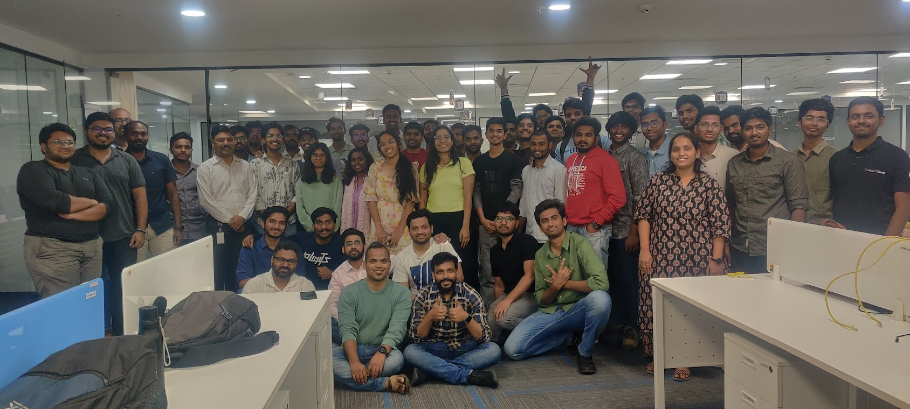

+++
path = "blog/hydpyhack2025"
title = "My experience as a Judge in a GenAI hackathon"
description = "From a hacker to a hackathon judge"
date = "2025-04-05"

[taxonomies]
tags=["python", "hackathon", "genai", "AI"]

[extra]
social_media_card = "hydpyhack-cover.webp"
+++

*Cover Image*

As a hackathon participant there is a sense of adrenaline rush and race against the clock; on the other hand being a hackathon jury was pretty chilled.
On 15th Feb'25 I have got a chance to become one of the three juries in a local python user group GenAI themed event in Hyderabad, India.
These are the following points I need to cover on this blog post:
1. The jury selection and my background
2. Discussing the evaluation criteria and forming a spreadsheet
3. Deciding the winners and distributing prize amount

### How did I get the invite?

I have been volunteering for Pycon India since 2019. In 2023, I have led the CFP workgroup and was a core member of the PyCon India 2023 which was organized by the Hyderabad Python User group. Therefore, I have a good amount of connection in the community.
The jury do not get any monetary benefit and all. This was a form of volunteering. I volunteered as I got the invite.
Along with me there were two more jury members.

### Use cases

These are the following use cases decided by the hackathon organizers and sponsors.
1. AI-Driven Business Insights from Data Lakes by Bilvantis Technologies
2. Voice agent for BFSI by Posibl AI
3. Conversational AI Assistant by Sarvam
4. Health Insurance Explainer Agent by Neuraoak Technologies

### Eval criteria

To know the eval criteria we need to understand the format of the Hachathon. There were predefined four use cases from the sponsors and other partners like Sarvam, Bilvantis and all. Each use cases consist of the followings
1. Problem Statement
2. Possible GenAI method to solve the problem
3. Recommendede Tech stack
4. Success criteria

There was success criteria mentioned on the basis of what we had to measure the success each hackathon use cases.
Here is an example of success criteria for the last use case:



1. Ability to make outbound calls and handle a basic call flow.
2. Quality of Tenglish Voice Interaction: Evaluate how natural and understandable the STT and TTS are when used for Tenglish. Does it sound reasonably like conversational Tenglish?
3. Accuracy of Benefit Explanation in Tenglish: Ensure the voice agent can accurately explain the key benefits of a health insurance policy in Tenglish.
4. Usefulness of English Call Summary: The generated English summary should be a helpful recap of the conversation.

Note: Effectively implementing a few (at least 1 or more) features is better than having an array of incomplete features.


### Resources for the attendees

#### Tools

1. [Bolt.new](https://bolt.new/) – Create beautiful, functional UI interfaces with prompts
2. [Lovable](https://lovable.dev/) – Create beautiful, functional UI interfaces with prompts
3. [Vapi AI](https://vapi.ai/) – Voice AI for developers
4. [Vercel v0](https://v0.dev/) – Create beautiful, functional UI interfaces with prompts
5. [Cursor](https://cursor.com/) – AI-native IDE

#### APIs

1. [Google Gemini](https://gemini.google.com/)
2. [OpenAI](https://openai.com/)
3. [Sarvam AI](https://sarvam.ai/)

#### Programming Languages

1. Python
2. JavaScript/TypeScript

### My experience

- There are two more jury members: [Sonu Kumar](https://www.linkedin.com/in/sonukr0/) and [Jitendra Santosh Varma Kosuri](https://www.linkedin.com/in/jitendra-santosh-varma-kosuri-93960626/).

*Score Spreadsheet*
- I have prepared a spreadsheet to evaluate the hackathon participants as they present their projects. This spreadsheet calculated the weighted average of the jury ratings and quickly decided the winners of the hackathon.
- The event was at the Bilvantis office in Hyderabad, where I recently moved from Bengaluru. I got a bit surprised to see 50+ participants in the event. Hyderabad tech city is not too far from Bengaluru.
- The enthusiasm of the participants was infectious.
- To be honest being a participant is much more exciting with adrenaline rush as the deadline approaches than being a jury. Sometimes, in a close contenst it may become a bit challenging for a jury to decide a winner but otherwise if given a chance I would like to be a participant than a jury.
- I would like to thank the sponsors, organizers, participants and jury members for making this event successful.

## Event Images

Few images of the event:

*Participants Presentation*

*Winner Selection Discussion*

*Jury Speech by yours truly*

*Winners*

*All attendees of the event who made it successful*