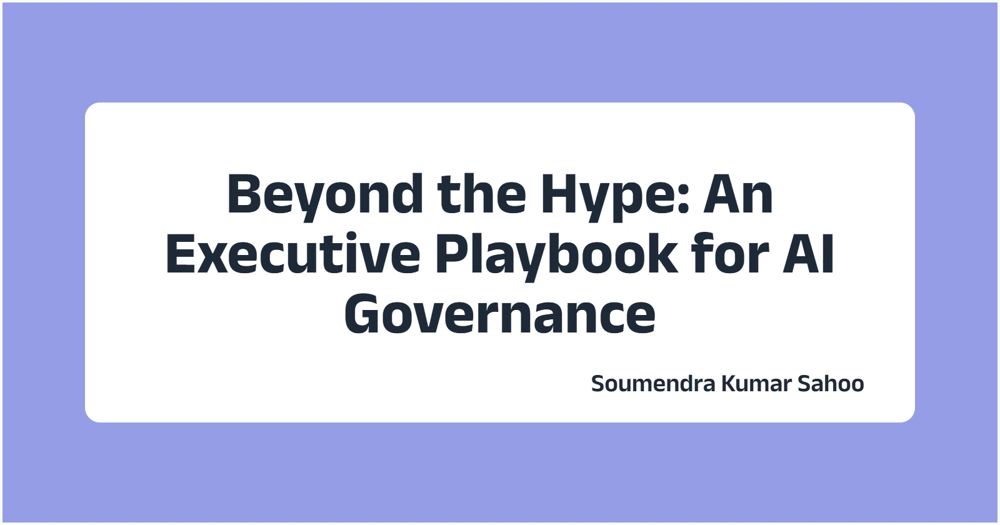

+++
path = "blog/ai-governance-playbook"
title = "Beyond the Hype: An Executive Playbook for AI Governance (2025 Edition)"
description = "A practical, case‑driven guide for CXOs and engineering leaders to build trustworthy, compliant and revenue‑generating AI systems."
date = "2025-07-09"

[taxonomies]
tags=["AI governance", "responsible AI", "AI"]

[extra]
social_media_card = "ai-governance.webp"
+++

---

> **TL;DR** — Good AI governance accelerates revenue, de‑risks regulatory exposure and earns stakeholder trust. This playbook delivers a six‑pillar governance framework, real‑world wins and missteps, and an executive‑friendly 90‑day action plan.

---

## 1  Why Governance Is Now Board‑Level Business

Global spending on enterprise AI is forecast to reach **\$297 billion by 2027**[^1]. Yet only **35 % of C‑suite leaders say they can fully explain their AI models to stakeholders**[^2]. Recent headlines show the cost of blind spots:

* **Block Inc.** paid **\$80 million** for deficient automated AML controls in Cash App[^3].
* The **EU AI Act** allows penalties up to **7 % of global turnover** for prohibited AI practices[^4].
* A proprietary **hospital sepsis predictor** missed two‑thirds of cases after data drift, triggering patient‑safety alarms and manual overrides[^5].

Governance is no longer a “nice to have”; it is business continuity.

## 2  What Exactly Is AI Governance?

AI governance is the **operating system** that aligns models with corporate strategy, ethics and regulation—from ideation to retirement. A resilient program unifies six pillars:

| Pillar                      | Purpose                   | Typical Artifacts                       |
| --------------------------- | ------------------------- | --------------------------------------- |
| **Policy & Standards**      | Define guardrails         | Ethical charter, coding standards       |
| **Risk Management**         | Identify & triage risks   | Model‑risk taxonomy, impact assessments |
| **Transparency**            | Make models explainable   | Data lineage, model cards               |
| **Accountability**          | Clarify ownership         | RACI matrix, audit logs                 |
| **Monitoring & Evaluation** | Detect drift & bias early | KPI dashboards, fairness tests          |
| **Continuous Improvement**  | Learn & iterate           | Post‑mortems, lessons‑learned library   |

## 3  Regulatory Landscape 2025

| Region    | Key Rule      | What Matters                                               |
| --------- | ------------- | ---------------------------------------------------------- |
| **EU**    | AI Act        | Fines up to 7 % of turnover; high‑risk use‑case registry   |
| **India** | DPDP Act 2023 | Consent‑driven data use, algorithmic transparency          |
| **US**    | NIST AI RMF   | Voluntary today; de‑facto gatekeeper for federal contracts |

## 4  The Cost of No Governance

> *“Move fast and break things” breaks differently when a model writes credit limits or medical orders.*

*Fin‑tech with a large‑language‑model chatbot launches without red‑teaming; within 48 hours it produces defamatory financial advice, prompting an SEC probe.*

*Healthcare provider’s sepsis model silently degrades; ICU teams disable alerts after false negatives rise 200 %. Regulators cite “algorithmic negligence.”*[^5]

## 5  Success Stories (It’s Not All Doom)

* **MediaMarkt (Retail)** — Implementing automated model cards and a cross‑functional review board cut approval cycles from 12 weeks to 3 and lifted revenue per user **14 %**[^6].
* **Discrete‑Manufacturing Major** — Pairing bias dashboards with differential‑privacy tooling around predictive‑maintenance models cut unplanned downtime by 30 % and avoided data‑protection fines.

## 6  90‑Day Implementation & Resource Blueprint

| Phase          | Goal                          | Typical Budget           | Critical Roles               |
| -------------- | ----------------------------- | ------------------------ | ---------------------------- |
| **Days 0‑30**  | Baseline & gap analysis       | \$25‑75 k (SMB)          | Governance lead, ML engineer |
| **Days 31‑60** | Policy draft + monitoring POC | \$75‑250 k (mid‑market)  | Compliance counsel, SRE      |
| **Days 61‑90** | Full rollout & training       | \$250 k‑1 M (enterprise) | Risk officer, SecOps         |

> **Prioritize first:** model registry, risk taxonomy, and real‑time monitoring. **Defer:** advanced fairness tooling until critical models are stable. Findings align with the 2024 Responsible AI Benchmark, where 72 % of organizations budget <\$500k for initial governance rollout[^7].

## 7  Stakeholder‑Engagement Framework‑Engagement Framework

| Stakeholder         | What They Care About       | Engagement Tactic                                  |
| ------------------- | -------------------------- | -------------------------------------------------- |
| **Board**           | Reputation, fines          | Quarterly “AI risk heat‑map” memo                  |
| **Engineering**     | Velocity, tooling overhead | DevEx‑friendly policy checklists                   |
| **Product & Sales** | Time‑to‑market             | “Governance guardrails = faster launches” roadshow |
| **Customers**       | Trust, reliability         | Plain‑language FAQs & transparency reports         |

Include pre‑baked comms templates for a 5‑slide board deck and a 2‑minute all‑hands update. Cultural shift tip: celebrate “bias bugs” the same way you celebrate security vulnerabilities — public kudos beats private blame[^2].

## 8  Vendor & Third‑Party Risk Management & Third‑Party Risk Management

* Treat every AI vendor as a **supply‑chain node**. Require disclosures on data provenance and model‑update cadence.
* Insert SLAs for **hallucination rate**, **prompt‑injection resilience**, and **data‑retention limits**.
* Use contractual language adapted from Deloitte’s Gen‑AI procurement playbook[^9].

## 9  Industry‑Specific Quick‑Checks‑Specific Quick‑Checks

| Sector                 | Key Extra Risks                | Must‑Have Controls                           |
| ---------------------- | ------------------------------ | -------------------------------------------- |
| **Healthcare**         | Diagnosis bias, FDA compliance | Model card + real‑time drift alarms          |
| **Financial Services** | Fair lending, AML              | Explainability reports + adversarial testing |
| **Retail**             | Dynamic pricing fairness       | Segmented bias metrics                       |

Refer to ISO/IEC 23053 for lifecycle definitions[^8] and ISO/IEC 42001 for management‑system alignment[^10].

## 10  Technical Implementation Essentials Implementation Essentials

* **Bias detection**: run counterfactual fairness tests per release.
* **Monitoring stack**: open‑source (e.g., WhyLogs) or enterprise (e.g., Truera) hooks into Prometheus/Grafana.
* **Model card template**: includes data lineage, performance by subgroup, and fallback logic.

## 11  Measurement & ROI Framework & ROI Framework

| KPI                           | Target  | Why It Matters                             |
| ----------------------------- | ------- | ------------------------------------------ |
| Time‑to‑deploy (days)         | ↓ 50 %  | Governance automation accelerates launches |
|  Incident MTTR (hrs)          | < 4 hrs | Faster recovery → less loss                |
|  Revenue at risk per incident | – 30 %  | Demonstrates cost‑avoidance                |

McKinsey finds orgs that mature AI governance capture **20‑40 % more value** from their models[^11].

## 12  Emerging Risks & Trends (2025‑27) Risks & Trends (2025‑27)

* **Generative‑AI supply‑chain risk** — rapid T\&C changes from model providers demand rolling contract reviews[^12].
* **AI supply‑chain security** — SBOMs for models, plus backdoor scanning.
* **Autonomous systems** — ISO 5338 process standards gaining traction.

## 13  Crisis‑Management Playbook‑Management Playbook

1. **Detect & Triage** — monitoring triggers “severity‑1 AI incident.”
2. **Contain** — roll back model or switch to rules engine.
3. **Communicate** — predefined press + social‑media templates in < 2 hrs.
4. **Investigate** — full root‑cause + bias impact analysis within 72 hrs.
5. **Remediate & Learn** — publish public post‑mortem; feed lessons into pillar 6.

## 14  Conclusion

AI’s upside is undeniable—but only if executives treat governance as a revenue enabler, not red tape. Start with the 90‑day plan above, measure everything, and iterate.

---

## References

[^1]: [https://www.cdomagazine.tech/aiml/global-ai-spending-to-reach-297-billion-by-2027-read-full-report](https://www.cdomagazine.tech/aiml/global-ai-spending-to-reach-297-billion-by-2027-read-full-report)

[^2]: [https://www.ibm.com/thought-leadership/institute-business-value/en-us/report/ai-governance](https://www.ibm.com/thought-leadership/institute-business-value/en-us/report/ai-governance)

[^3]: [https://www.michigan.gov/difs/news-and-outreach/press-releases/2025/01/15/michigan-joins-80-million-enforcement-action-against-block-inc-cash-app-for-violations](https://www.michigan.gov/difs/news-and-outreach/press-releases/2025/01/15/michigan-joins-80-million-enforcement-action-against-block-inc-cash-app-for-violations)

[^4]: [https://artificialintelligenceact.eu/article/99/](https://artificialintelligenceact.eu/article/99/)

[^5]: [https://jamanetwork.com/journals/jamainternalmedicine/fullarticle/2781307](https://jamanetwork.com/journals/jamainternalmedicine/fullarticle/2781307)

[^6]: [https://www.mckinsey.com/capabilities/growth-marketing-and-sales/solutions/periscope/resources/impact-stories/mediamarkt-masters-personalization-experience-delivery-at-scale](https://www.mckinsey.com/capabilities/growth-marketing-and-sales/solutions/periscope/resources/impact-stories/mediamarkt-masters-personalization-experience-delivery-at-scale)

[^7]: [https://www.modelop.com/resources-ebooks/responsible-ai-report-2024](https://www.modelop.com/resources-ebooks/responsible-ai-report-2024)

[^8]: [https://www.iso.org/standard/74438.html](https://www.iso.org/standard/74438.html)

[^9]: [https://www2.deloitte.com/dl/en/pages/legal/articles/contracting-generative-ki-risikominderung-lieferkette.html](https://www2.deloitte.com/dl/en/pages/legal/articles/contracting-generative-ki-risikominderung-lieferkette.html)

[^10]: [https://aws.amazon.com/blogs/security/ai-lifecycle-risk-management-iso-iec-420012023-for-ai-governance/](https://aws.amazon.com/blogs/security/ai-lifecycle-risk-management-iso-iec-420012023-for-ai-governance/)

[^11]: [https://www.mckinsey.com/\~/media/mckinsey/business%20functions/quantumblack/our%20insights/the%20state%20of%20ai/2025/the-state-of-ai-how-organizations-are-rewiring-to-capture-value\_final.pdf](https://www.mckinsey.com/~/media/mckinsey/business%20functions/quantumblack/our%20insights/the%20state%20of%20ai/2025/the-state-of-ai-how-organizations-are-rewiring-to-capture-value_final.pdf)

[^12]: [https://www.reuters.com/legal/legalindustry/ai-focused-procurement-playbook-refresh-2024-04-10/](https://www.reuters.com/legal/legalindustry/ai-focused-procurement-playbook-refresh-2024-04-10/)
