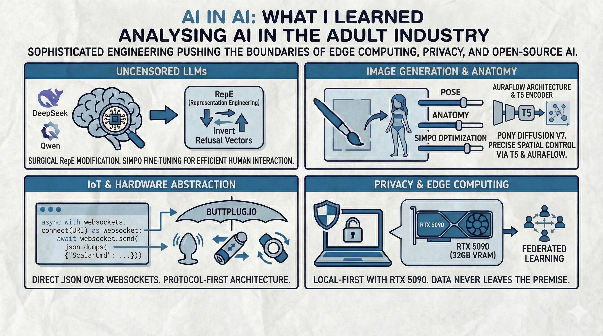

+++
title = "AI in AI: What I Learned Analysing AI in the Adult Industry"
description = "I went down the rabbit hole of AI in the adult industry. I expected simple chatbots; I found a sophisticated engineering stack pushing the boundaries of edge computing, privacy and opensource AI."
date = "2026-01-25"

[taxonomies]
tags=["AI", "GenAI", "LLM", "opensource"]

[extra]
social_media_card = "ai_in_ai-cover.webp"

+++


This is the kind of topic where my sheer curiosity propelled me to write this post. I was researching "uncensored" AI models for a side project when I stumbled upon a vibrant, chaotic and surprisingly sophisticated ecosystem.

We've all heard the adage: *the adult industry pioneered streaming video, online payments and VR*. But in the age of Generative AI, is that still true? I decided to dig deeper. I wanted to see how the technology I work with daily: LLMs, diffusion models and real-time inference is being used in the "real world" where corporate safety filters don't apply.

What I found wasn't just "porn bots." I found what practitioners call **"Computational Intimacy"**, a complex engineering stack that makes our enterprise AI look... well, prudish and slow.


graph LR
    subgraph Enterprise AI Stack
        E1["Cloud Providers (OpenAI, AWS)"]
        E2["Guardrailed Models"]
        E3["Compliance-First Privacy"]
        E4["500ms+ Latency Tolerance"]
    end
    subgraph Adult Industry AI Stack
        A1["Self-Hosted Open Source"]
        A2["Abliterated/DPO Models"]
        A3["Local-First Privacy"]
        A4["Low-Latency Target (500ms+)"]
    end
    E1 -.->|"Constraints"| A1
    style E1 fill:#f9d5e5
    style A1 fill:#d5f9e5


---

## 1. The "Uncensored" LLM Landscape

In my day job, we spend weeks aligning models to be safe, polite and helpful. In this industry, the goal is the opposite: raw, unfiltered human interaction. The term they use is "uncensored," though a more accurate term might be "refusal-inhibited." The engineering behind it is genuinely impressive.

### What Surprised Me

They don't just "jailbreak" ChatGPT. They have completely **abandoned mainstream commercial providers** (OpenAI, Google, Anthropic) in favor of the open-source ecosystem. The reason is simple: if your model says "I can't do that, Dave" in the middle of an intimate roleplay, you've lost the user.

**The Model of Choice:** The community has largely standardized on [**DeepSeek-V3**](https://github.com/deepseek-ai/DeepSeek-V3), [**Qwen 3**](https://qwen.ai/research) and [**Mistral Small 3**](https://mistral.ai/news/mistral-small-3/) derivatives.

Here's the kicker: they don't just use them out of the box. They use advanced fine-tuning techniques that we're still experimenting with in enterprise.

### The "Representation Engineering" (RepE) Revolution

This was a new term for me. It's a successor to the brute-force [**abliteration**](https://huggingface.co/blog/mlabonne/abliteration) techniques of 2024. Instead of damaging the model's weights to break safety rails, engineers use **Representation Engineering (RepE)** to surgically invert specific "refusal vectors" in the model's residual stream.

The idea is that safety alignment lives in a specific set of activations. You can identify them via probing, then mathematically invert them. It's elegant, dangerous and absolutely fascinating engineering. 

> **The Ethical Tension:** This isn't theoretical harm. When you can remove a model's ability to refuse, you unlock *everything*: non-consensual deepfakes, CSAM and impersonations. Governments have caught up with the **TAKE IT DOWN Act** (US, May 2025) and the **DEFIANCE Act** (Jan 2026) now criminalize non-consensual deepfakes. India's **2025 IT Rules Amendment** mandates 36-hour removal windows with strict penalties (up to ₹250 crore under the DPDP Act). The same "weight surgery" that allows a harmless roleplay bot also enables federal crimes. The line between "creative freedom" and "liability" has vanished.

### Fine-Tuning: SimPO over DPO

The industry has shifted from **DPO (Direct Preference Optimization)** to **SimPO (Simple Preference Optimization)**. Models like [**Nous Hermes**](https://huggingface.co/NousResearch) and [**Psyfighter**](https://huggingface.co/KoboldAI/LLaMA2-13B-Psyfighter2) use this because it's approximately 20% more efficient and requires 10% less VRAM than DPO, as it doesn't need a reference model loaded in memory.

**Why SimPO?** Traditional SFT gives the structure; SimPO gives the *soul*. For a hobbyist running on a single GPU, not needing to load a second "reference model" during training is the difference between fine-tuning a 70B model or crashing with OOM errors.

If you've ever had a chatbot "forget" who you are mid-conversation, you know why this is hard. Somehow, a roleplay bot made by hobbyists on an **RTX 5090** does it better than some commercial products.

---

## 2. Image Generation: The Art of Anatomical Precision

While we're playing with DALL-E 3, the adult industry has moved almost entirely to specialized [**Flux.2**](https://blackforestlabs.ai/) and [**Pony Diffusion V7**](https://civitai.com/models/pony-diffusion-v7) architectures.

Why? **Anatomical Control.**

### The PonyFlow Revolution

**Pony Diffusion V7** is *not* just another SDXL fine-tune. It's built on the **AuraFlow** architecture (nicknamed "PonyFlow"), utilizing a T5 text encoder. This allows for complex spatial descriptions that older CLIP-based models simply couldn't resolve.

**The Latent Space Knows Anatomy:** Why does this work so well? These models have learned a rich "latent space" an internal representation of human form and pose. Tags like `from_behind`, `looking_at_viewer`, `hand_on_hip` map to specific *directions* in this latent space. The T5 encoder allows for natural language understanding of these spatial relationships.

It's prompt engineering taken to an absurd, almost comical, extreme.

### LoRAs: Microservices for Generative Media

Instead of retraining a 6GB model for every new character, they swap in a **100MB LoRA adapter**. It's a modular, plug-and-play approach to generative media.

Think of it like this: your base model is the monolith and LoRAs are the microservices you deploy on top. You can stack them: `base_model + character_lora + art_style_lora + clothing_lora`.

I found it elegant. Also, I found a LoRA for "Victorian era Gentleman" which I will not be explaining to my spouse.

---

## 3. The "Internet of Things" (Teledildonics): Where I Found the Best Code

{{ admonition(icon="info", title="Info", text="Teledildonics, also referred to as cyberdildonics, is a term used to describe virtual sexual encounters that involve the use of networked electronic sex toys to replicate and expand human sexual interactions. --[Wikipedia](https://w.wiki/3vU4)") }}

This is where the engineering genuinely impressed me. I expected proprietary, walled-garden hardware. Instead, I found [**Buttplug.io**](https://buttplug.io/) and the **Intiface** ecosystem.

Yes. That is its name. I can see you smirking.

It is a Rust-based, open-source library that acts as a hardware abstraction layer for over **750 different physical devices**. It handles Bluetooth, USB and WebSocket protocols.

Frankly, the Smart Home industry could learn a thing or two about standardization from this project.

### Show Me The Code: Direct Protocol Implementation

{{ admonition(icon="warning", title="Legacy Code Warning", text="*Update Jan 2026:* The old wrapper libraries are largely deprecated. In 2026, the 'best practice' is arguably even cooler: **Direct Protocol usage**. Because the architecture is so standardized, you don't need a heavy client library. You just need to speak JSON over WebSockets to the Intiface Central hub.") }}


Here is a modern Python script using `asyncio` and `websockets` to control a device directly. This is the definition of "clean" IoT.

```python
import asyncio
import json
import websockets

# The standard Intiface Central WebSocket address
URI = "ws://127.0.0.1:12345"

async def vibrate_device():
    async with websockets.connect(URI) as websocket:
        
        # 1. Handshake: Tell the server who we are (Protocol v3)
        await websocket.send(json.dumps({
            "RequestServerInfo": {
                "Id": 1,
                "ClientName": "Modern AI Client",
                "MessageVersion": 3
            }
        }))
        print(await websocket.recv()) # Server says hello back

        # 2. Start Scanning for devices
        print("Scanning for hardware...")
        await websocket.send(json.dumps({
            "StartScanning": { "Id": 2 }
        }))
        
        # Wait a bit for bluetooth handshake...
        await asyncio.sleep(5) 
        
        # 3. Request the list of found devices
        await websocket.send(json.dumps({
            "RequestDeviceList": { "Id": 3 }
        }))
        response = json.loads(await websocket.recv())
        
        devices = response.get("DeviceList", {}).get("Devices", [])
        
        if not devices:
            print("No devices found. Is your bluetooth on?")
            return

        device = devices[0]
        print(f"Found device: {device['DeviceName']}")

        # 4. The Magic: Send a command (Vibrate at 50% power)
        # This JSON payload works on ANY vibrating device supported by the engine.
        cmd = {
            "ScalarCmd": {
                "Id": 4,
                "DeviceIndex": device["DeviceIndex"],
                "Levels": [{"Index": 0, "Level": 0.5}] # 50% Intensity
            }
        }
        
        print("Sending vibration command...")
        await websocket.send(json.dumps([cmd]))
        
        await asyncio.sleep(2)
        
        # 5. Stop
        cmd["ScalarCmd"]["Levels"][0]["Level"] = 0.0
        await websocket.send(json.dumps([cmd]))
        print("Stopped.")

if __name__ == "__main__":
    asyncio.run(vibrate_device())
```

Look at that. No vendor SDKs. No proprietary blobs. Just standard JSON sent over a standard WebSocket.

A few observations:
1.  **It's Protocol-First:** The abstraction is so good that I don't need a specific Python library. I just need to know the JSON schema.
2.  **The Abstraction is Beautiful:** The command `ScalarCmd` with `Level: 0.5` works whether the device is a $20 Bluetooth bullet or a $500 robotic arm. The server handles the translation.
3.  **This is Better Than Most IoT Libraries:** I have written code for "smart" lightbulbs that was infinitely more painful than this.

The fact that I can write raw JSON to a localhost port and control hardware from 30 different vendors is a testament to superior software architecture.

---

## 4. Engineering Challenges: Where They Are Ahead of Us

The industry isn't just consuming AI; they are hitting engineering bottlenecks that we haven't fully solved yet.

### A. The Latency of "Intimacy"

In a customer support chat, a 2-second delay is acceptable. In an intimate voice conversation with an AI companion, it breaks the illusion entirely. You can't have your AI partner say "mmm, tell me more" after a 1.5-second awkward silence.

The standard AI pipeline is:
`User Audio -> Speech-to-Text -> LLM Inference -> Text-to-Speech -> Avatar Lip Sync`

Each step adds latency. A pause at any stage feels unnatural.

**Their Solution:** They are aggressively pursuing:
*   **End-to-End Multimodal Models:** Audio-in, Audio-out. Skip the transcription step entirely.
*   **Edge Computing (The RTX 5090 Era):** The release of the **RTX 5090 (32GB VRAM)** in Jan 2025 changed the game. It allows for running unquantized 30B+ parameter models locally. While "real-time" on a mid-range card (RTX 4060) is still a challenge, high-end setups are getting faster.
*   **Real-Time Lip Sync:** Libraries like [**LivePortrait**](https://github.com/KwaiVGI/LivePortrait) are genuinely impressive. However, the bottleneck isn't just the video anymore; it's stitching the whole Audio-LLM-TTS-Video pipeline together, which often pushes total latency to 1-2 seconds.

| Component | Realistic Latency |
|-----------|------------------|
| STT | 100-500ms |
| LLM (7B) | ~700ms per response |
| TTS | 200-500ms |
| Lip Sync | 12.8ms + overhead |
| **Total** | **~1000-2000ms** |

### B. Privacy as a Feature, Not a Compliance Checklist

Cloud storage is a *catastrophic* liability in this domain. A data breach isn't just a GDPR fine and a PR statement; it can ruin lives.

This forces the architecture to be **Local-First** by necessity, not by ideology.

**Practical Implementations:**
*   **On-Device Inference:** Heavy investment in quantization. The **RTX 5090's 32GB VRAM** allows for running larger models locally than ever before. Mobile users on **RTX 50-series laptops** (24GB VRAM) can now run serious workflows on the go.
*   **Federated Learning:** Research into learning user preferences (what works, what doesn't) locally and sending only encrypted gradient updates to a server. The server never sees the raw data.

I found this genuinely admirable. They treat privacy as a *product requirement* because failure means headlines, not just a fine. **Caveat:** It's not magic; researchers have shown that "gradient leakage" attacks can theoretically reconstruct training data from these updates, so it's not a silver bullet, but it's a massive improvement over sending your raw chats to a centralized server.

---

## 5. Lessons Learnt (What We Can Steal)

After analyzing this ecosystem, I walked away with three key takeaways for any software engineer:

1.  **Constraints Drive Innovation:** When you can't use the easy cloud APIs (OpenAI/AWS) due to censorship or cost, you are *forced* to innovate with Open Source. This constraint has made this community masters of self-hosted, quantized and fine-tuned AI. User experience demands (real-time interaction, privacy guarantees) forced innovation where enterprise AI was complacent. They have optimized edge inference for their specific use case in ways that offer lessons for enterprise AI.

2.  **Privacy-First is Possible:** We often say "data must be in the cloud" for AI to work. This industry proves that you can build sophisticated, personalized AI experiences that never leave the user's `localhost`. Enterprises can learn valuable lessons here about local-first architectures for processing sensitive customer data without it ever leaving the premise. If they can do it for intimate companion apps, we can do it for enterprise analytics.

3.  **Hardware Abstraction Matters:** `Buttplug.io` is a masterclass in separating software logic from hardware implementation. The next time I write an IoT integration and it's a mess of vendor-specific SDKs, I will think of this library and weep gently.

---

## 6. Methodology & Limitations

### Methodology
To ensure this reflected the 2026 landscape, I analyzed model performance on the [HuggingFace Open LLM Leaderboard](https://huggingface.co/spaces/HuggingFaceH4/open_llm_leaderboard), reviewed technical discussions on [r/LocalLLaMA](https://www.reddit.com/r/LocalLLaMA/) and the [SillyTavern](https://github.com/SillyTavern/SillyTavern) community[^2] and cross-referenced claims with Arxiv papers from late 2024 and 2025.

### Caveats
*   **Snapshot in Time:** AI moves fast. This analysis reflects the state of the art as of January 25, 2026.
*   **Hardware Variance:** Latency claims are highly dependent on specific hardware (e.g., VRAM speed, quantization level). "Real-time" results cited typically require RTX 4090 class hardware.
*   **Observational Nature:** This is an analysis of community engineering practices, not an endorsement of specific content or a primary engineering benchmark.

---

## 7. Conclusion



It's easy to dismiss this industry. But the engineering rigor I found was undeniable. They are solving problems: latency, long-context coherence, device abstraction and privacy that are relevant to every domain of AI.

I started this research out of simple curiosity. I ended it realizing that the "bleeding edge" sometimes comes from the places we least expect. And that sometimes, the most professionally written code you'll find is for a device you probably shouldn't mention in a scrum meeting.

---

## Appendix: Current "State of the Art" Models

For those interested in the raw data (strictly for research, of course), here is the current leaderboard in this space as of late 2025.

| Type | Name | Purpose | License |
| :--- | :--- | :--- | :--- |
| **LLM** | [**DeepSeek-V3.2 (Dec 2025)**](https://github.com/deepseek-ai/DeepSeek-V3) | The new standard. A hybrid reasoning model that unified "thinking" modes. Extremely efficient MoE. | MIT / Apache 2.0 |
| **LLM** | [**Qwen 3 (MoE)**](https://qwen.ai/research) | The open-source hegemon. Variants like **Qwen3-235B-A22B** allow massive scale intelligence on consumer hardware (if you have the VRAM). | Apache 2.0 |
| **LLM** | [**Mistral Small 3 (Jan 2025)**](https://mistral.ai/news/mistral-small-3/) | High efficiency (150+ tokens/s). Optimized for latency-sensitive roleplay. | Apache 2.0 |
| **Image** | [**Pony Diffusion V7**](https://civitai.com/models/1901521/pony-v7-base) | Built on **AuraFlow**. The new king of adherence and anatomy. Uses T5 encoder. | Apache 2.0 |
| **Image** | [**Flux.2 [dev] / [klein]**](https://blackforestlabs.ai/) | The frontier of visual intelligence. [klein] variant allows high fidelity on lower VRAM. | Non-Commercial |
| **Protocol** | [**Buttplug.io / Intiface**](https://buttplug.io/) | The standard for hardware control. Moved to Intiface Central hub architecture in 2026. | BSD 3-Clause |

---

[^1]: https://www.techfornontechies.co/blog/how-porn-drives-tech-innovation
[^2]: Community engineering practices sourced from [HuggingFace Open LLM Leaderboard](https://huggingface.co/spaces/HuggingFaceH4/open_llm_leaderboard), [r/LocalLLaMA](https://www.reddit.com/r/LocalLLaMA/) and [SillyTavern GitHub discussions](https://github.com/SillyTavern/SillyTavern) (2024-2025). Not official benchmarks.
