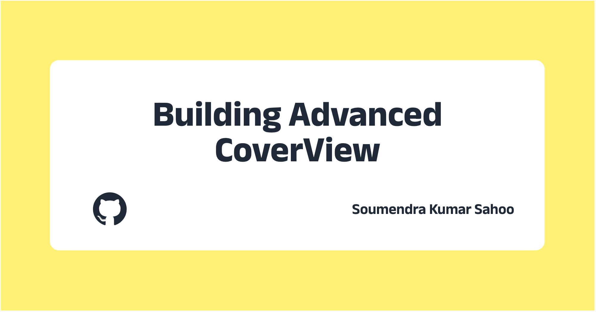

+++
title = "Resurrecting an Abandoned Project: CoverView"
description = "I forked CoverView and added pattern backgrounds, color palettes, platform presets and fixed Unsplash bugs. Here's my journey of improving an abandoned opensource tool."
date = "2026-01-18"

[taxonomies]
tags = ["opensource", "side-project", "tools"]

[extra]
social_media_card = "advanced-coverview-cover.webp"
+++



A few years ago, my portfolio and blog lived on separate islands. I was maintaining my blog site at Hashnode. There I discovered [CoverView](https://github.com/rutikwankhade/CoverView), a tool to create cover images for blog posts. It was simple, fast and had nice themes. I used it for over two years.

Last year, I merged my separate website and blog into a single site. During this time, I also experimented with Nano Banana for creating cover images. But those felt distracting and didn't work well as OG images for social media sharing. So I came back to CoverView.

## The Frustrations

Despite using CoverView for years, a few things always annoyed me:

1. **Pattern theme bug**: I randomized themes once and got a beautiful pattern-based background. But when I tried to download it, *nothing happened*. There was a bug preventing downloads for pattern themes.

2. **Abandoned project**: The last commit was two years ago. Issues were piling up with no responses.

I got frustrated enough to think, *"Let me just fix it myself."*

## Original vs Advanced: What Changed

| Feature | Original CoverView | Advanced CoverView |
|---------|-------------------|-------------------|
| Platform dimensions | Manual input | Pre-configured presets for 7+ platforms |
| Pattern backgrounds | Broken downloads | 16 working SVG patterns |
| Color selection | Basic picker | Preset swatches + brand color saving |
| Unsplash pagination | First 30 images only | "Load More" with infinite scroll |
| Search state | Lost on image close | Preserved with scroll position memory |
| Default author | Creator's name | "Your name goes here" |
| Copy to clipboard | Not available | One-click copy to clipboard |

## Why Fork Instead of Build from Scratch?

The project had an MIT license, making it easy to fork. I had been a user for a long time, so I understood what needed fixing. And honestly, building from scratch is too much work. If something already exists and works 80%, why rebuild it? Just fix the bugs and add what's missing.

## What I Added

### Platform Presets
Pre-configured dimensions for different platforms:
- Hashnode, Dev.to, Medium
- LinkedIn, Twitter, Facebook
- YouTube thumbnails
- Custom sizes

No more Googling "Twitter card image size 2026". Select your platform and the dimensions are set automatically.

### Pattern Backgrounds
16 SVG pattern options including graph-paper, jigsaw, dots, circuit-board and more. The patterns that were broken before now work and download correctly.

### Color Preset Swatches
Quick color selection with a collapsible palette. I find myself using this the most. Picking colors is now much faster. I can save my brand hex codes, so I never ship a blog post with slightly-off colors. Consistency matters.

### Enhanced Unsplash Integration
The original had Unsplash support, but with issues:

- **Pagination**: Added "Load More Images" button to browse beyond the initial 30 results
- **Search Query Persistence**: Your search term stays when you select/deselect images
- **Scroll Position Memory**: Returns to your exact scroll position after closing a selected image
- **State Caching**: All loaded images are cached to avoid re-fetching

### Copy to Clipboard
One-click button to copy the generated cover image directly to your clipboard. No need to download first, then upload. Just copy and paste wherever you need it.

### Bug Fixes & UX Improvements
- Fixed dropdown overflow issues in sidebar
- Smooth scroll restoration without visual flicker
- Reset scroll to top on new search
- Changed default placeholders to "Your name goes here" and "Title goes here"

## Building Process

### Tools Used
- **Windsurf with Claude** as the primary developer
- **Google Gemini** and **GPT 5.2** as code reviewers

### Time Spent
Around 4-5 hours total.

### The Challenging Part
The most challenging feature was maintaining state while searching Unsplash images. When a user closed an image they didn't like, the app needed to revert to the original search query and scroll position. Getting this flow smooth without visual flicker took some effort.

The original code had no scroll position tracking at all. It was a simple component with local state:

```javascript
// Original: No scroll position memory
const UnsplashSearch = ({ largeImgPreview }) => {
    const [imageList, setImageList] = useState([]);
    const [searchText, setSearchText] = useState('setup');
    const { unsplashImage, setUnsplashImage } = useContext(ImgContext);
    // ... rest of component
}
```

My first attempt added scroll restoration using `useEffect` with a `setTimeout`, but this caused a visible flicker because `useEffect` runs after the browser paints.

The fix was switching to `useLayoutEffect` which runs synchronously before the browser paints:

```javascript
// Fixed: useLayoutEffect runs before paint, no flicker
const scrollContainerRef = useRef(null);
const shouldRestoreScroll = useRef(scrollPosition > 0);

useLayoutEffect(() => {
    if (scrollContainerRef.current && shouldRestoreScroll.current && scrollPosition > 0) {
        scrollContainerRef.current.scrollTop = scrollPosition;
        shouldRestoreScroll.current = false;
    }
}, [imageList, scrollPosition])
```

I couldn't fully fix the responsiveness for medium screens like tablets. That remains an open issue.

### Working with Legacy Code
There were commented-out code blocks and patterns I didn't fully understand. But honestly, it didn't matter much; Claude handled most of the heavy lifting. I focused on *what* needed to change, not *how* the existing code worked.

## Deployment

My DNS provider is [Cloudflare](@/blog/2025/12/self-hosting/index.md) and Cloudflare Pages is free, reliable and just works. The subdomain `cover.soumendrak.com` was a natural choice: "Advanced CoverView" shortened to "cover."

## Do I Use My Own Tool?

Yes! Starting from this very blog post, I'm using Advanced CoverView for all my cover images. You can look at my older posts to see images created with the original CoverView.

### What I Actually Use
- **Color palettes**: my most-used feature
- **Icon selection**: playing around with 100+ dev icons
- **Theme switching**: trying different layouts

### What I Don't Use
**Unsplash images**. I find them distracting for blog covers. They were there in the original, so I kept and improved them, but it's not for me. Someone reported issues with Unsplash in the original repo, so I fixed those bugs anyway.

## Screenshot


## Contributing Back

I've tried to contact the original creator, Rutik Wankhade. If he responds, I'm open to pushing my changes to the original repo. But there might be conflicts. I made decisions he may or may not agree with, like changing the default author name placeholder from his name to "Your name goes here". For now, I'll maintain it as a separate fork.

## Lessons Learned

1. **Forking is underrated**: You don't need to build everything from scratch. Find a good base, fix what's broken, add what's missing.

2. **Small frictions compound**: Changing the default author name every single time seems minor. But over two years, it becomes a real annoyance worth fixing.

3. **Abandoned ≠ useless**: A project with no recent commits can still be valuable. The code works; it just needs someone to maintain it.

4. **AI handles the "how"**: I didn't need to understand every line of the existing codebase. I focused on *what* to fix and Claude figured out *how*.

5. **Eat your own dog food**: I've been using CoverView for years. That's why I knew exactly what was wrong and what to fix.

## Try It Yourself

- **Live App**: [cover.soumendrak.com](https://cover.soumendrak.com)
- **GitHub**: [github.com/soumendrak/Advanced-CoverView](https://github.com/soumendrak/Advanced-CoverView)

---

## Acknowledgments

- [Rutik Wankhade](https://rutik.dev): original creator of CoverView
- [Hero Patterns](https://heropatterns.com/): SVG pattern backgrounds
- [Devicons](https://devicon.dev/): developer icons
- [Unsplash](https://unsplash.com/): image integration

---

## Related Articles

- [Building a Speed Reader App: A Prototype That Taught Me More Than It Helped Me Read](@/blog/2026/01/developing-a-speed-reader/index.md)
