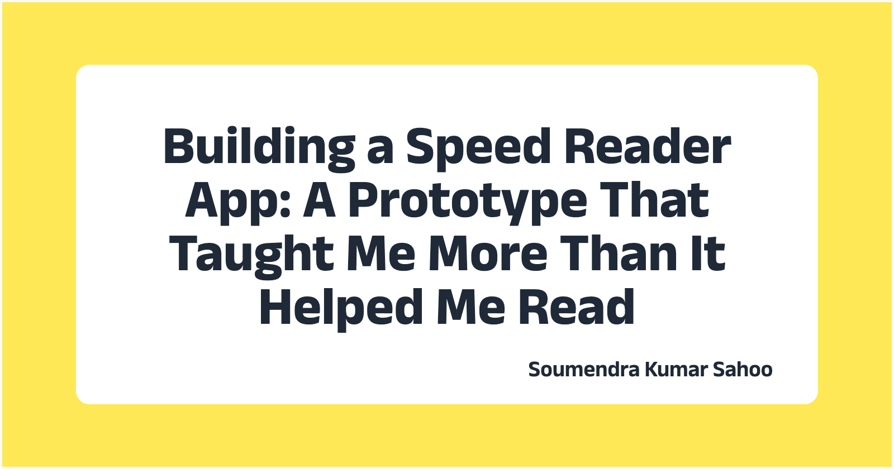

+++
title = "Building a Speed Reader App: A Prototype That Taught Me More Than It Helped Me Read"
description = "I built an RSVP-based speed reader app in a few hours using AI tools. Here's why I stopped using it after a day and what I learned about building vs. solving problems."
date = "2026-01-17"

[taxonomies]
tags = ["AI", "side-project", "lessons-learned"]

[extra]
social_media_card = "speed-reader-cover.webp"
+++

## Background

Recently, I came across a Reddit post where someone had built an RSVP (Rapid Serial Visual Presentation) speed reader app in just 3-4 hours. RSVP is a technique where words are displayed one at a time at a fixed focal point, allowing you to read without moving your eyes across the page.

With the revolution of LLMs, I consider myself a full-stack developer now. So I thought, *"Why not? I can also build it."* I wanted to prove a point: making prototypes is easy nowadays. I also wanted to test the app myself without sharing my text with any external application for privacy reasons.

## Building the App

I used **Windsurf with Claude Opus 4.5** and **Google Gemini 3 Pro** as a critic. The build took a few hours.

### The Challenge: Miscommunication with the LLM

Initially, the LLM misunderstood my requirement. It thought I was building a **screen reader app**, an accessibility tool that reads aloud whatever is on the screen. My requirement instructions weren't clear enough.

Here's what I learned: once an LLM takes a path and starts implementing, it's difficult to modify from that path. **If it takes 1 prompt to create something, it takes 10 prompts to undo it.** Yes, you can restore to a previous state, but if you want to do modified tweaking instead of a complete undo, that's where the real challenge lies.

### Features I Built

The app ended up with these features:

- **RSVP Display Engine**
- **ORP Highlighting**: Middle letter highlighted for optimal recognition
- **Adjustable Speed**: 100-1000 WPM with real-time adjustment
- **Punctuation Delays**: Automatic pauses after sentences and clauses
- **Progress Tracking**: Visual progress bar with time remaining
- **Dark/Light Mode**: Automatic system detection + manual toggle
- **Keyboard Shortcuts**: Space (play/pause), R (restart), E (end), Esc (back)

You can try it at [reader.soumendrak.com](https://reader.soumendrak.com) or check the [GitHub repo](https://github.com/soumendrak/speed-reader).

## My Experience: One Day of Testing

I used the app on the 15th and 16th of January. Here's my honest review.

### The Realization

After using it for a day, I realized **RSVP isn't suited for my reading style**. When I read articles, I don't go word-by-word. I scan entire paragraphs in a fraction of a second to decide if they're worth reading in detail. This "preview and decide" approach can't be automated in a sequential word reader.

### The LLM Era Problem

Nowadays, because of great summarization tools using LLMs, nobody wants to read entire articles. People read summaries first. I'm telling you about myself: I read the summary first; if I like that summary, then I go through the article.

Here's the paradox:

| Stage | Do I Need Speed? | Does RSVP Help? |
|-------|------------------|-----------------|
| **Scanning headlines** | Yes | No, I glance at paragraphs, not word-by-word |
| **Reading summary** | No | No, the summary already caught my attention; I *want* to absorb it |
| **Deep reading article** | No | No, if I chose to read, I want to go slow and understand |

The summary caught my attention. That's why I clicked on that article. So allow me to read it at my own pace. I don't want to quickly read these things.

## Lessons Learned

### 1. Building is Easy, Solving Problems is Hard

AI tools make prototyping trivially easy. I saw someone build it, so I built it too. But **ease of building ≠ ease of use** or **problem-solution fit**.

### 2. Validate the Problem First

- The problem I thought I had: "Read faster"
- The actual need: "Decide what to read faster" (skimming)

RSVP solves the wrong problem for my workflow.

Also, check if someone already solved this. Later, I discovered that Chrome extensions for RSVP reading already exist. One example is [Sprint Reader](https://chromewebstore.google.com/detail/kejhpkmainjkpiablnfdppneidnkhdif), a speed reading extension with 4.4 stars and thousands of users. I thought my app should be a full-fledged website, but it should have been an extension, not a standalone website. Someone already figured this out years ago.

### 3. Be Your Own First User

If you won't use your own app, who will? I spent around 30 minutes every day post-lunch keeping up with the latest AI findings. I block my calendar for this. After building this app, I just summarized articles using Perplexity and read from there. The app sat unused.

### 4. Give Clear, Complete Instructions to LLMs

When working with AI tools, vague instructions lead to multiple back-and-forth iterations. For example, when reading Perplexity summaries, I wanted to remove citations. I first asked it to "remove the regex patterns of citations," which only removed the square brackets. Then I had to ask again to remove the footnote links. I could have simply said: "Remove the citations and their references from the text." One clear, complete instruction beats multiple partial ones.

### 5. Know When to Stop

Sunk cost fallacy is real. "Cool looking" ≠ "useful." If I'm not using this application, I don't know who else will be using it. No need to give more time to this.

## Who Might Still Benefit?

Despite my experience, RSVP readers might help:

- People consuming **pre-committed content** (e-books, newsletters they trust)
- **Accessibility** use cases (some people with dyslexia find RSVP helpful)
- **Training** to reduce subvocalization

## Conclusion

This prototype "failed" in the sense that I stopped using it after a day. But it succeeded in teaching me valuable lessons:

1. **Prototypes are cheap**: build them to learn, not just to ship
2. **Your workflow matters**: understand how you actually consume content before building tools for it
3. **Give complete instructions**: one clear prompt beats multiple partial ones
4. **It's okay to stop**: not every side project needs to become a product

The code is open source at [github.com/soumendrak/speed-reader](https://github.com/soumendrak/speed-reader). Feel free to use it if RSVP works for your reading style.

---

## Related Articles

- [The Ultimate AI Tools Collection](@/blog/2024/07/ai-tools/index.md)

