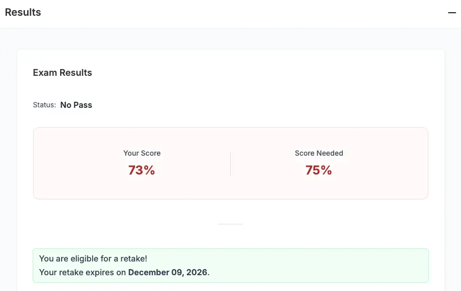
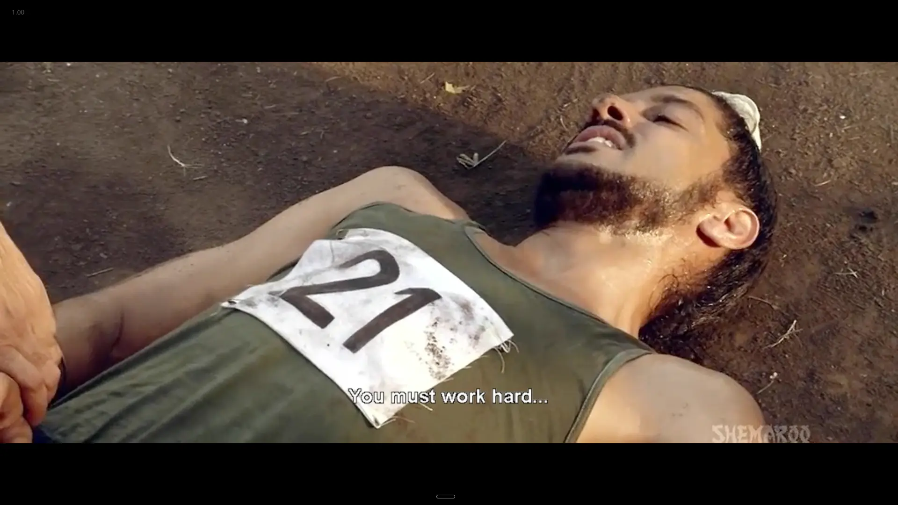
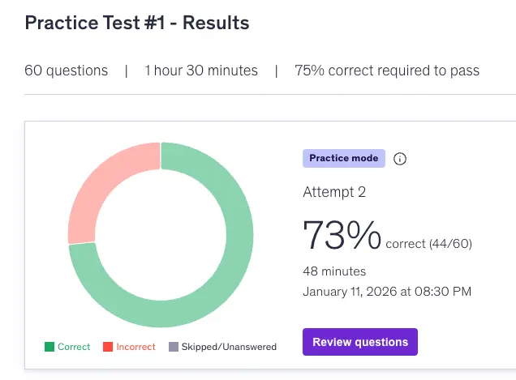

+++
title = "How to become an OpenTelemetry Certified Associate (OTCA)"
description = "How did I become an OpenTelemetry Certified Associate (OTCA)? My journey to certification."
date = "2026-01-13"

[taxonomies]
tags=["OpenTelemetry", "Observability", "Certification"]

[extra]
social_media_card = "OTCA-cover.webp"
pinned = true
+++

## Background
The last time I appeared for any proctored certification exam was four years ago in 2021, when I obtained my [AWS Certified Machine Learning – Specialty - Credly](https://www.credly.com/badges/abd00b47-bde3-438f-bb18-5bdccd7c87ba/public_url) certificate, which expired in 2024.

I knew [Observability](@/series/practical-observability-with-python/_index.md) as a phase in MLOps when I was at Freshworks. I joined PepsiCo as an AI Observability Architect. Therefore, I had to build the acumen to live up to my designation. Certifications are an easy way to showcase your skillsets. Therefore, I completed a bunch of AI Observability certifications from Arize. Then, I completed a certificate on OpenTelemetry called "Getting Started with OpenTelemetry" back in June 2025. 

## 50% Black Friday Discount
The next stage after that free certification was the OTCA certificate, which is a paid one and the only one available for OTel. In general, it costs 250 USD. It was expensive, but it had been on my radar for quite some time. On Black Friday, I learned they were offering discounts, and I purchased the certification at a 50% discount for 125 USD. I had no clue if I would be able to complete the certification or not. I was convinced that if I wanted to stay in this domain, I had to earn this certificate.

## Preparation
With that, I planned to prepare for it during the year-end holidays. I followed this plan initially until my first attempt:
1. Revisiting the course [Getting Started With OpenTelemetry](https://trainingportal.linuxfoundation.org/courses/getting-started-with-opentelemetry-lfs148), especially its GitHub repo; this is the only free course the Linux Foundation has on OTel.
2. Taking help from Google Gemini to create mock exams using its canvas feature.
3. Going through some YouTube tutorials.

I could not take the exam at the end of the year as the New Year vibe distracted me, and I was occupied with connecting my [self-hosted jellyfin server](@/blog/2025/12/self-hosting/index.md) to my TV, which were 1000 km away from each other.

## Scheduling Exam
You can schedule the exam 24 hours in advance, up to 90 days from the purchase date. There were no limited slots. Therefore, I decided to book it in a "Tatkal" train ticket booking style, just before the exam day, i.e., 10th Jan 2026. I booked the exam for 10:30 PM. I revisited my notes, ran the code, and got ready for the exam.

## Proctored Exam
You need to join the exam link 30 minutes before the exam time (10 PM in my case). After joining, a proctor will join and chat with you. Oh boy! After this AI revolution, the definition of a proctored exam has changed completely. It was not like this when I took the AWS ML Specialty exam in 2021. The proctor checked the following:
1. I used my webcam to show my desk.
2. Everything kept on my desk, like my keyboard, mousepad, and laptop; I lifted them to show nothing was underneath.
3. A water bottle with no labels/stickers.
4. Behind my monitor.
5. Under my desk.
6. A 360-degree view of my room, with me standing and giving a room tour.
7. My ceiling and my floor.
8. Clearing all headphones and extra laptops.
9. Closing the doors so that nobody could enter.
10. Showing my ears to the webcam so they could be sure I didn't have an earpiece.
11. Showing them my glasses to confirm they were not smart glasses.
12. It is not allowed to put your hands in front of your mouth.
13. You cannot lip-sync or even read the questions aloud.
14. You cannot look around.
15. Your complete face should be visible to the webcam all the time; do not get too close to the question. *I got a warning here*.
16. Showcase your hands.
17. At the end, show them on another mobile what the webcam looks like.

## Heartbreak
I encountered some errors while installing the custom browser; the error appeared again, but finally, I just closed the error pop-up, and it worked. Ignorance is bliss.
There were 60 questions and 90 minutes. I could afford to get 15 questions wrong and still pass.
The first time I attempted the exam, I scored 73%. The passing mark was 75%. I think I answered one or two questions incorrectly. Immediately, I received an email stating I didn't make it and explaining how to retake the exam.

It hurts a lot when you miss the passing mark by just 2%. I was feeling so low and was on the verge of depression the whole night, then I remembered one scene from [Bhaag Milkha Bhaag](https://en.wikipedia.org/wiki/Bhaag_Milkha_Bhaag) out of nowhere, where Milkha Singh got selected even though he failed due to a sharp stone while running.
This changed my perspective: I did not fail by 2%; I failed by 27%. Score 100% so that the cut-off will not scare you anymore.

With this mindset, I rebooked the exam right then and there. It was late, so the earliest slot I got was 12:30 AM. I booked it. I knew that if I didn't do it this weekend, I wouldn't do it next weekend or even in three months. I had so many things to do, and I didn't want to wait for this certification. I had already spent my year-end holidays preparing for this.

## Second and Final Attempt Preparation
- As soon as I got the email that I failed, I noted down all the questions where I was confused by the available options. I couldn't remember all of them, but I recalled around 22 questions. This reminded me of the days when I took medical entrance exams. After the PMT/JEE exams, our coaching center staff used to give us a piece of paper and ask us to write down the questions and options we remembered. In this way, they crowdsourced all the questions from the candidates. The next day, the questions and answer keys would be published in the newspaper.
- I cloned the OTel documentation GitHub repo and saved these questions in a file. I asked Claude Code to find the answers and citations. I got all the answers and their explanations.
- I searched a bit more and remembered that I used to get practice exam papers from Udemy. I bought a 6-set practice exam there for 399 INR. I scored the same 73% there. There were so many incorrect responses. I felt frustrated at first, but then I convinced myself that the more incorrect responses I got here, the fewer I would get in the exam. *The more you sweat, the less you bleed.* 

Frankly speaking, just an hour before the exam, I should not have attempted these practice exams; it added frustration and drained unnecessary mental energy. I had to watch a few mindless reels to return to a normal state.

## The Now or Never Exam
On a winter night at 12 AM, when everywhere was silent except for the dogs, I logged into the portal. Last time, I went through every question serially from 1 to 60. This time, as soon as I saw a long question or one that needed more thought, I flagged it for review.
In that way, I went through rounds of iteration on the flagged questions, reducing them with each round.
Finally, I counted how many questions I was unsure of; there were 12 out of 60. This made me confident that I would pass this time.
In school, I had a habit of submitting answer sheets just 5 minutes before the exam end time. I did the same this time. 
Finally, I refreshed my email multiple times and saw the result at the portal.
I got 88% this time. 

As soon as the results appeared, street dogs barked exactly at the same time to celebrate.

<object data="/pdfs/otca.pdf" type="application/pdf" width="100%" height="650px">
      
Unable to display PDF file? <a href="/pdfs/otca.pdf">Download</a> instead.

</object>

---
## Preparation Materials
These are the materials I used to prepare for the exam:

1. [Getting Started With OpenTelemetry](https://trainingportal.linuxfoundation.org/courses/getting-started-with-opentelemetry-lfs148)
2. [Getting Started With OpenTelemetry GitHub Repo](https://github.com/lftraining/LFS148-code)
3. [Udemy Practice Exam](https://www.udemy.com/course/opentelemetry-certified-associate-otca-practice-exams/?couponCode=CP250112G3)
4. [OTCA Exam Questions and Answers with the help of Claude Opus 4.5](https://gist.github.com/soumendrak/53e54cfcfdfdc3f66ce19dc2e524e76f)
5. [Documentation GitHub Repo](https://github.com/open-telemetry/opentelemetry.io)
