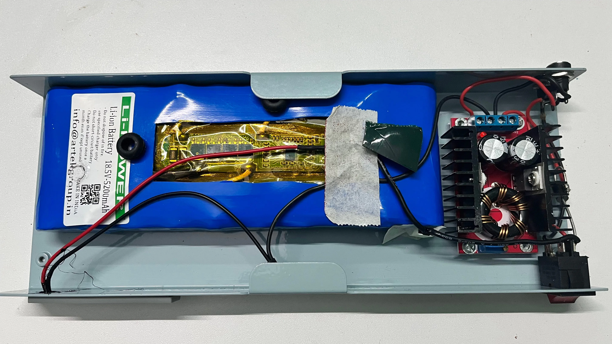

+++
title = "Week 4: Hello World"
date = 2026-01-25
+++

To document my journey on AI Observability, FOSS and technology. I have started this weekly note to make my learning more concrete and share it with the world.

## What I learned
- Startups in India can get subsidized GPU access through the [India AI Compute Portal](https://compute.indiaai.gov.in/)
- Got introduced to [Anna's Archive](https://annas-archive.li/search?q=) by a colleague for books.
- In the [Wayback Machine Chrome Extension](https://chromewebstore.google.com/detail/wayback-machine/fpnmgdkabkmnadcjpehmlllkndpkmiak) you can automatically save the webpages permanently.

## What failed
- There was a long power cut and my mini PC battery drained. When the power restored, it never worked.

- Jellyfin is behaving strangely. It is unable to play the video files after the restart. I have made [transcoding changes](https://jellyfin.org/docs/general/post-install/transcoding/) from Vaapi to AMD transcoding. It started working, but once I tried to change the quality of the video, it stopped working.
- Tried to import my website's old [analytics data](https://github.com/rybbit-io/rybbit/pull/464) from Umami to Rybbit. Did not able to suceed. I was able to export the postgres DB dumpt to CSV, but not sure Rybbit always showed no records found.
- Tried to install [Lidarr](https://github.com/Lidarr/Lidarr) and [Ombi](https://ombi.io/) for music management. However, the search was not at all working. I parked it to try again later.

## What I built
- Started a series on [Practical Observability with Python](@/series/practical-observability-with-python/_index.md)
- I have connected my physical server to my VPS server and able to show the status of the containers running in my physical server. I installed tailscale on my VPS server and able to connect to my physical server.