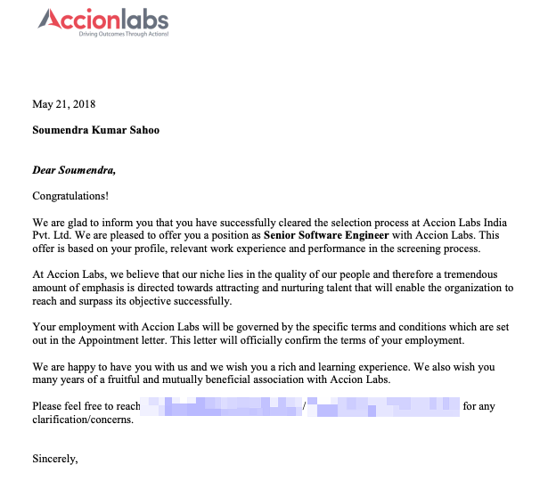

+++
path = "blog/accion-labs-interview-questions"
title = "[Offered] Accion Labs interview questions"
description = "My interview experience at Accion Labs and what I learned."
date = "2018-04-26"

[taxonomies]
tags=["career", "interview", "python"]

[extra]
social_media_card = "accion-labs-cover.webp"
+++

## 👉🏼 Background

- Years of Experience: 5+ years
- Relevant Python experience: 3+ years
- Year: April 2018
- Campus: [Sigma Tech Park, Whitefield, Bangalore](https://osm.org/go/yy400fKSP?way=360342802)
- Position: Python developer
- Company: [Accion Labs](https://www.accionlabs.com/)

## First Round

1. What are the data structures in Python ? 
2. What are the differences between list and tuple ? 
   1. Demonstrate how both are immutable/mutable 
   2. Gave example of list inside tuple and vice versa 
   3. Can we extend/append a tuple to another tuple 
3. Why dictionary keys should be hashable and immutable ? 
   1. How hashing happen inside dictionary 
4. Else clause inside list expression 
5. What is git reset command 
6. What is Duck Typing  
7. What are the main OOP in Python ? 
8. What is Polymorphism ? 
9. Why Python is used in ML ? 
10. What makes Python unique from other languages ? 

### Suggestions for upcoming rounds

The interviewer suggested to learn on the following sections 

1. Data structures and operations 
2. Advanced data structures 
   1. Namedtuple 
   2. Defaultdict 
   3. Orderedict 
3. Oops concepts 
   1. Inheritance 
   2. Polymorphism 
   3. Abstraction 
   4. Encapsulation 
4. Design Patterns 
5. REST API design and development 
6. Github/Git 
7. Linux basic operation 
   1. How to make a file extracting only the second  column of the original file ? 
   2. Reduction 
   3. Pipe 

The interviewer advised not to mug-up things, but go deep and ask yourself why is this happening, what will happen if design patterns/polymorphism is not there. 

## Second Round 
It was a take home assignment.

<object data="accion-labs-take-home-assignment.pdf" type="application/pdf" width="100%" height="1800px">
      
Unable to display PDF file? <a href="accion-labs-take-home-assignment.pdf">Download</a> instead.

</object>

The interviewer reviewed my take home assignment and praised my coding skills and did not ask a single Python question. He was not Indian. 

## Third Round 

I got asked the following questions:
- Object oriented programming in Python 
- Tell me about Inheritance 
- Tell me about Duck typing 
- Inheritance vs Object composition 
- Disadvantages of using Inheritance 
- Design patterns 
  - Factory 
  - Singleton  
- REST 
- Constraints in REST 
- Different types of HTTP methods 
- Difference between POST and PUT methods 
- Are you familiar with AMPQ, RabbitMQ to process task requests  
- What is the significant of 'pass' in Python ? 

He was not Indian. He was kind of satisfied with my answers.

## Fourth Round

There was a FIVE persons panel interview. They asked me the following questions:

1. Git stash 
2. How to ETL a cricket score page through MongoDB 
3. How to download a large file from cloud 
4. How to describe Cloud to a 6 year old 
5. Which type of people you like and do not like 
6. How do you approach people you do not like 
7. How do you convince a colleague who is not helping you 
8. Do you love to work remote or with teammates ? 
9. Preferences on a particular technology stack 
10. Python frameworks used 
11. How to do website extraction 
12. Difference between Beautifulsoup and Scrapy ? 
13. AWS EC2 ? 
14. When to use S3 cloud 
15. How to denote class in CSS 
16. How to extract data chunk wise from web 
17. Difference between list, dictionary and set ? 
18. How to do a domain setup in AWS through Route52 ? 
19. Any experience on Dockerization 
20. How do you deploy your product ? 
21. How do you maintain CI/CD in your product ? 
22. How do you use Jenkins ? 
23. Which tool do you use for version management? 
24. Do you like a short team or large team ? 
25. Difference between IBM DB2 and MongoDB 
26. How do you maintain these two DBs 

This was an hour long grind. But, I liked the queries a few I was not able to answer.

## Verdict
I got selected and got the offer letter.

This is a part of my [job interviews series](@/series/job-interviews/_index.md).

Let me know if you have any further questions. Thank You 🙏🏼
