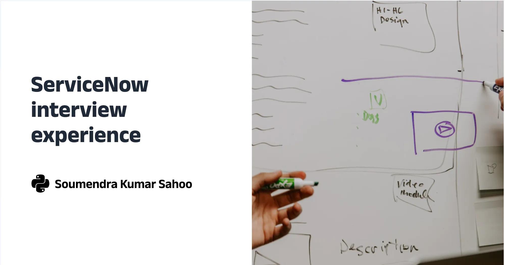

+++
path = "blog/servicenow-interview-experience"
title = "Servicenow interview experience"
description = "My interview experience at Servicenow and what I learned."
date = "2019-12-01"

[taxonomies]
tags=["career", "interview", "python"]

[extra]
social_media_card = "snow-cover.webp"
+++



## 👉🏼 Background

- Years of Experience: 7+ years
- Relevant Python experience: 5+ years
- Year: December 2019
- Campus: [Knowledge City, Madhapur, Hyderabad](https://maps.app.goo.gl/vdmrJkmh6XtaVC8r7)
- Position: Senior Software Engineer
- Company: [Servicenow](https://www.servicenow.com/)

They have flown me to Hyderabad for the interview. I was working at IBM, Bengaluru during this time.

## First Round

I got asked the following questions:

1. Data modeling 
2. Algorithm of the problems 
   1. Assigning points to an weighted array with duplicate elements 
   2. I felt like I did well, but the interviewer said I did not. :'(  
3. Overall architecture design and representation if the problem statement 
4. How topic modelling is done 
5. How query classification is done 
6. How does the re-ranking happen in the search engine? 
7. If given a chance, how can I improve the overall architecture of the system 


This was the problem statement I was asked to solve:

```
[5, 4, 7, 9] --> single stock per day changes 
30 days 
- no two consecutive days trade -->  
- input can be +/- or 0 
- Trading is not mandatory if no profit --> Check positive number in the array 
- number of days trade unlimited 
maximum profit 
input-1: [5, 4, 7, 9, 8] ---> gains/losses per day 
input-2: [5, -4, 7, 9] ---> gains/losses per day 
input-3: [0, -4, -7, 0] ---> gains/losses per day 
output-1: [0, 3] --> position of the days we can trade 
 [5, 1, 3, 109, 908, 1018, 2017] 
5, 3, 908 
5, 109, 1018 
```

They said they need a senior level position who can convince for the design to the broader audience and based on that get the requirement sorted out. 

## Second Round

Due to the feedback from the first round, I was not liking to stay around anymore and I was feeling pretty hungry. In this scenario, they asked me for another round of interview. I was asked the following questions:

 

1. Data modeling of a newspaper vender distributor having dashboard and user registration 
   1. Relationship between the user management and vendor 
2. Recommendation engine in the newspaper vending system 
3. Scenario where I have conflict with the design and decision of the management and how did I handle it? 
   1. Benchmarks I have used 
   2. Pros and Cons of the different approaches 
   3. How did you make peace with yourself 
4. User facing applications I have worked on before (if any) 
   1. Said about Cognitive search with UI, Chatbot and API interaction 
5. Business requirement specific work I have done: 
  a. Told about the Email entity extraction I have worked with 

## Verdict
Rejected Brutally.

## Lessons Learnt
I was bad in data modeling. I need to work upon those. Whiteboarding is not my strong suit. I need to work upon that. 

## Overall experience
The person who was the PoC of me, after telling me what all things to do, he straight away went to a game room to play foosball. There were open pantry and I had my lunch there. I was not sure if I should go there or not. But, anyway I could not got the courage to ask anyone after the brutal rejecton.
I felt a bit sad as they have spent money to do this in-person interview by making me fly from Bengaluru to Hyderabad and I could not live upto their expectations.

Anyway, the office space was awesome inside. However, outside it was all dusty and construction was going on that street with lot of noise.
Now, in 2026 this place is all modernized and looking awesome.