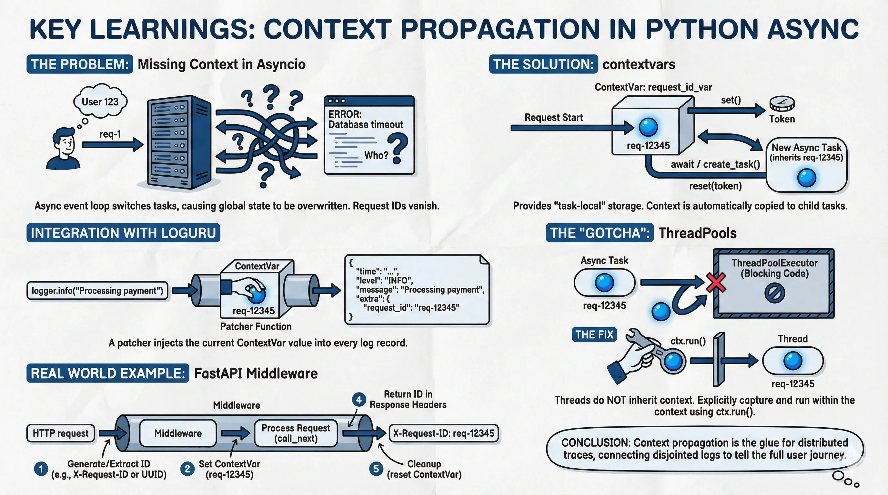

+++
title = "2: Context Propagation"
description = "Why your request IDs disappear in Python async applications, and how to fix it using ContextVars."
date = "2026-01-22"

[taxonomies]
tags = ["Python", "Observability", "Asyncio"]

[extra]
social_media_card = "context-propagation-cover.webp"
og_image = "context-propagation-cover.webp"
+++


In [Part 1](@/series/practical-observability-with-python/structured-logging/index.md), we solved the first half of the observability puzzle: moving from unstructured text logs to structured JSON events. We learned that `grep` is dead and that logs should be treated as data.

But as soon as you deploy that beautiful structured logger into a real-world async application (like FastAPI), you hit a new wall.

You have 100 concurrent users. You see an error log:
```json
{"level": "ERROR", "message": "Database connection timeout", "timestamp": "..."}
```

Great. *Which user* faced this error? Which API request triggered it?

Unless you manually pass a `user_id` and `request_id` to every single function in your call stack, you have no idea. This is the "Context Propagation" problem.

## The Pain Points of State in Asyncio

In the old days of synchronous Python (Flask, Django), we used `threading.local()` to store global state for a request. Since one request equaled one thread, it worked perfectly.

In the world of `asyncio`, it's not that simple.

A single thread runs an **event loop** that switches between thousands of tasks. If you set a global variable `REQUEST_ID = "123"` at the start of a request, and then `await asyncio.sleep(0)`, the event loop might switch to another request that overwrites that variable to `"456"`. When you wake up, your ID is wrong.

We need something that behaves like a **thread-local**, but for **async tasks**.

## The Solution: `contextvars`

{{ admonition(icon="info", title="Info", text="All the code snippets are available at [Chapter 2: Code](https://github.com/soumendrak/observability-engineering-series/blob/main/chapters/ch2-context-propagation/)") }}

Python 3.7 introduced the [`contextvars`](https://docs.python.org/3/library/contextvars.html) module specifically to solve this. It provides storage that is "task-local".

### 1. Defining the Variable

First, we define a global `ContextVar`. This object acts as the key to our storage.

```python
import contextvars

# The default value is None if no value is set
request_id_var = contextvars.ContextVar("request_id", default=None)
```

### 2. Setting the Context

When a request starts (e.g., in a middleware), we set the value. This returns a `Token` that allows us to reset it later (though in most request/response cycles, the context naturally dies with the task).

```python
token = request_id_var.set("req-12345")
# ... do work ...
request_id_var.reset(token)
```

Now, crucially, if we `await` a new coroutine or use `asyncio.create_task()`, Python **automatically copies** the current context to the new task. Child tasks inherit the `request_id` of their parent.

## Integration with Loguru

Loguru doesn't know about our `ContextVar` by default. We have to teach it to look there using a **patcher**.

A patcher is a function that runs *before* the log record is serialized. It's the perfect place to inject context.

```python
import sys
from loguru import logger

# 1. Define the patcher
def correlation_id_patcher(record):
    rid = request_id_var.get()
    if rid:
        # Inject it into the 'extra' dict
        record["extra"]["request_id"] = rid

# 2. Configure Logger
logger.remove()
logger.add(sys.stdout, format="{time} | {level} | {message} | {extra}")
logger.configure(patcher=correlation_id_patcher)
```

Now, you can just log normally:

```python
async def process_payment():
    # No need to pass request_id as an argument!
    logger.info("Processing payment") 
```

Output:
```text
2026-01-28 10:00:00 | INFO | Processing payment | {'request_id': 'req-12345'}
```

## The "Gotcha": ThreadPools

This is where 90% of developers get stuck.

Sometimes you need to run blocking code (like `requests` or image processing) inside an async app. You use `loop.run_in_executor` (which uses a `ThreadPoolExecutor`).

**The problem:** Unlike `asyncio.create_task`, threads spawned by `ThreadPoolExecutor` do **NOT** inherit the `contextvars` of the parent automatically. Your `request_id` vanishes the moment you enter the thread.

### The Fix

You must explicitly copy the context and run the function inside it.

```python
import functools

async def run_in_thread(func, *args, **kwargs):
    loop = asyncio.get_running_loop()
    
    # Capture the current context (including our request_id)
    ctx = contextvars.copy_context()
    
    # Run the function in the thread, but WRAPPED in ctx.run
    func_call = functools.partial(ctx.run, func, *args, **kwargs)
    
    return await loop.run_in_executor(None, func_call)
```

Using this helper ensures your logs inside the thread still have the correct Trace ID.

## Real World Example: FastAPI Middleware

In a FastAPI app, you want this to happen automatically for every request.

```python
from fastapi import Request, Response
from uuid import uuid4

@app.middleware("http")
async def correlation_id_middleware(request: Request, call_next):
    # 1. Generate or extract ID
    req_id = request.headers.get("X-Request-ID", str(uuid4()))
    
    # 2. Set the context var
    token = request_id_var.set(req_id)
    
    try:
        # 3. Process request
        response = await call_next(request)
        
        # 4. Return ID to client
        response.headers["X-Request-ID"] = req_id
        return response
    finally:
        # 5. Cleanup
        request_id_var.reset(token)
```

## Conclusion


*This image is created using [Google Gemini](https://gemini.google.com/share/30172880e2c1)*

Context propagation is the glue that holds distributed traces together. Without it, you have a pile of disjointed logs. With it, you can tell the full story of a user's journey through your system—across async tasks, threads, and eventually (as we'll see later), across network boundaries.

In the next post, we will look at **OpenTelemetry Tracing**, taking this concept further to visualize these requests as flame graphs.

---

## Resources

*   **Chapter 2 Code:** [GitHub - ch2-context-propagation](https://github.com/soumendrak/observability-engineering-series/tree/main/chapters/ch2-context-propagation)
*   **Python `contextvars` Documentation:** [docs.python.org/3/library/contextvars](https://docs.python.org/3/library/contextvars.html)
*   **Loguru (Structured Logging Library):** [GitHub - Delgan/loguru](https://github.com/Delgan/loguru)
*   **FastAPI (Async Web Framework):** [fastapi.tiangolo.com](https://fastapi.tiangolo.com/)
*   **Python `asyncio` Documentation:** [docs.python.org/3/library/asyncio](https://docs.python.org/3/library/asyncio.html)
